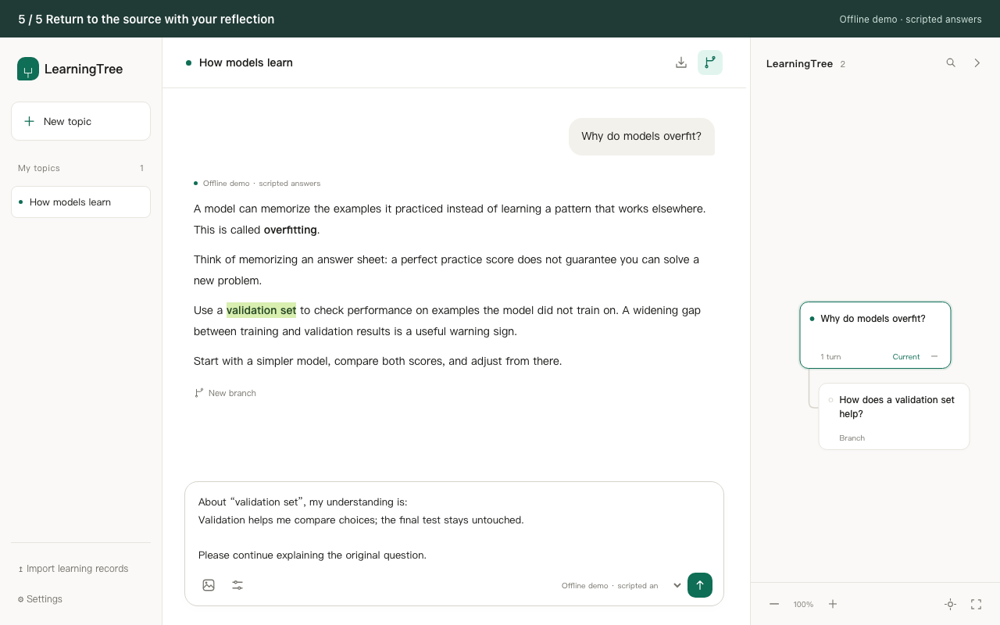
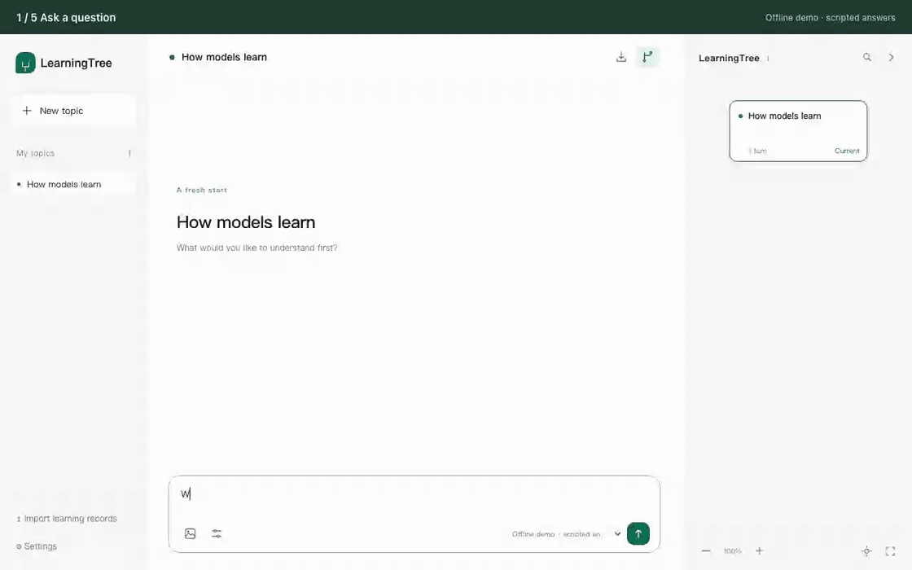

# LearningTree

[中文说明](README.zh-CN.md) · [MIT license](LICENSE) · [Contributing](CONTRIBUTING.md)

A personal workspace for learning with AI. Ask a question, explore unfamiliar ideas in branches, and return to the original explanation without losing your place.



<details>
<summary>Watch: explain a term → explore a branch → return with your understanding</summary>



</details>

The images use synthetic content and the offline demo model. They demonstrate the interface, not AI answer quality; real answers require your own model configuration.

## Features

- A continuous conversation alongside an interactive topic map: jump to any turn, pan, zoom and return to your previous view after centering.
- Select text for a quick explanation or create a branch from an answer. Return to the exact source passage when you finish.
- Branch titles summarize the first question you ask, rather than copying the source answer. A new empty branch shows “New branch”.
- Save your understanding and bring it into the main conversation as an editable draft.
- Edit a question as a new version, retry interrupted answers, and keep the original record.
- Attach PDFs, Word `.docx` files or text documents to a question; preview parsed text, retain the original and keep references through follow-ups, retries and revisions. See [formats, limits and how text reaches the model](docs/documents.md).
- Budget long conversations per model: keep recent full turns, extract cited source sentences from older context, and let the agent reread eligible originals when needed.
- Recall relevant learning memories with local multilingual search, while keeping topic facts within the current learning path and user preferences separate.
- Switch **English / 中文** in **Settings → 语言 / Language**. Labels change immediately; your conversations and notes keep their original language.
- Connect OpenAI-compatible Chat Completions or native Anthropic Messages. Optional MCP tools add web reading, local files, memory, browser actions, thinking steps and time lookup.
- Export individual trees as JSON and import them without overwriting existing records.

LearningTree is a **local, single-user application**. Its offline demo uses fixed responses to demonstrate interactions; it is not a real AI model.

## Quick start

Install [uv](https://docs.astral.sh/uv/getting-started/installation/) and [Node.js 24 LTS](https://nodejs.org/en/download). Python 3.11+ is required; uv can install the version in `.python-version` automatically. Node.js 22.12+ is supported.

```sh
git clone https://github.com/Yuyang16Z/learning-tree.git
cd learning-tree
uv run python scripts/manage.py setup
uv run python scripts/manage.py dev
```

Open **http://127.0.0.1:5174** to try the offline demo without an API key. You can also import [`examples/learning-tree.sample.json`](examples/learning-tree.sample.json). Demo replies currently use Chinese. Keep the terminal open; Ctrl+C stops the app.

Basic setup installs the application dependencies without PyTorch, Transformers or local model weights. It uses keyword memory retrieval; semantic retrieval is optional.

For your own learning workspace, stop the demo and run:

```sh
uv run python scripts/manage.py start --open
```

Open **http://127.0.0.1:8099** and add your endpoint, model ID and API key in **Settings → Models & API keys**. This workspace uses a separate database from the demo. On macOS, after setup, you can also double-click `启动学习树.command`.

### Optional semantic memory

```sh
uv run python scripts/manage.py retrieval
```

This installs the `retrieval` extra and prepares pinned local E5-small embeddings and BGE-reranker-v2-m3 reranking. Allow approximately **2.55 GiB of model weights**, plus tokenizers and Python dependencies; inference also needs RAM. No additional API key is needed. Restart the app afterward and check **Settings → Memory**. Basic chat and keyword retrieval remain available if preparation fails.

For a new full installation, use `setup --with-retrieval`. If `.env` explicitly selects `MEMORY_RETRIEVAL_MODE=lexical`, change it to `hybrid` to enable semantic retrieval. Normal startup loads cached models in the background and never downloads weights. See [model setup and troubleshooting](docs/operations.md#local-memory-retrieval).

## Configuration

No `.env` is needed for normal use. Configure models in Settings. To select another data file or seed an initial model, copy `.env.example` to `.env` and edit it locally.

| Option | Behavior |
| --- | --- |
| OpenAI-compatible | Uses Chat Completions; use the base URL and model ID provided by your service. |
| Anthropic | Native Messages, streaming, images and tool calls. Official base URL: `https://api.anthropic.com`. Output limit defaults to 4,096 tokens. |
| Editing an API key | Leaving it empty retains the existing key. |
| Context budget | In the model's **Advanced** settings, set its actual context window and answer reserve. Local estimates and extractive compression need no extra model or download. |
| Optional MCP | Follow the [MCP guide](integrations/mcp/README.md) to install and register six presets, or configure your own server. |
| Web search | DDGS by default; `TAVILY_API_KEY` opts into Tavily. Errors are reported explicitly. |
| Learning memory | Keyword retrieval works in the basic installation. Optional local vectors and reranking add semantic retrieval; `MEMORY_RETRIEVAL_MODE=lexical` disables them. |

Capabilities depend on the provider and model. Native OpenAI Responses and Gemini protocols are not implemented. UI language does not translate saved content; quick explanations follow the selected language, and normal answers depend on the prompt and model.

Each branch's first question triggers one short background title request with the question and a source excerpt, without tools or images. Failures keep a question-based label. Established, custom and imported titles are preserved.

Memory facts are limited to valid sources on the active path. Optional semantic retrieval combines BM25 and E5 with reciprocal rank fusion (RRF), then BGE reranking. Preferences use a separate budget, and recent conversation context is retained. This searches built-in memory, not MCP graphs or learning files; relevance is not a truth check. See the [memory architecture](docs/architecture.md#learning-memory-retrieval).

Long-context handling is separate from memory retrieval: it budgets each request, including tool results, and compresses older conversation into cited original sentences without rewriting stored messages. Estimates are conservative local approximations, not exact provider token counts; compression can omit relevant material. See [context budgets, source rereading and limits](docs/context-budget.md).

## Development and checks

```sh
uv run python scripts/manage.py dev      # API :8100, Vite :5174, .runtime/dev.db
uv run python scripts/manage.py check    # Python lint/format, tests, TypeScript, build

# Install the test browser once.
node web/node_modules/playwright/cli.js install chromium --only-shell
uv run python scripts/manage.py e2e
```

Development uses a separate SQLite file and seeds an offline demo on first use. Models you later add to that development database remain available and may make real requests. Development, `check` and `e2e` force lexical retrieval, so they do not load or download semantic models. Tests use fixed mock providers; browser tests use a temporary database and random loopback port without personal data or paid calls. GitHub Actions runs these checks on pushes and pull requests.

After installing optional semantic retrieval, download/repair its model cache and test actual inference with synthetic Chinese and English examples:

```sh
uv run python scripts/prepare_retrieval.py --smoke
```

Run this with hybrid retrieval enabled. It does not open your chat database or call an answer-model API. It checks local model inference separately from the offline regression suite; it is not a broad answer-quality benchmark. See the [synthetic model validation](docs/memory-retrieval-validation.md) for pinned versions, measured costs and retained relevance counterexamples.

```text
app/                 FastAPI routes, providers, context, persistence and MCP runtime
web/src/             React workspace, map, chat, settings and localization
tests/               Backend regression tests
scripts/             Portable setup, development, backup and verification commands
integrations/mcp/    Optional pinned MCP tools and launchers
examples/            Synthetic sample data and a minimal MCP server
docs/                Architecture and local operation guide
```

See [architecture](docs/architecture.md), [operation and backups](docs/operations.md), and [contribution guidelines](CONTRIBUTING.md).

Changes and upgrade notes: [v0.2.0](docs/releases/v0.2.0.md) · [Changelog](CHANGELOG.md).

## Your data

The default data file is `branch_learning.db`; the legacy filename and JSON format identifier are retained for compatibility. Startup backs up an existing database into `.backups/` before building the UI. Run only one backend per database.

Chats, notes, document originals and parsed text, model keys and tool configuration are stored locally. Keys are in the private SQLite file, **not encrypted at rest**. Drafts and reading positions stay in browser storage. Tree exports omit model keys and server configuration but contain the exported conversation and attachments, including document originals. MCP memory and learning files require separate backups. Uploading a document is local; eligible excerpts are sent to your configured answer model when they enter a question's context.

Existing memory IDs and content are preserved. SQLite adds a rebuildable `MemoryEmbedding` cache keyed by memory and model revision, with a content hash to detect stale text; deleting memories or their source nodes removes the associated cache entries. Public model weights live in `.runtime/retrieval/models/`. Deleting a memory does not delete the original conversation: the same information may still appear in active-path chat history. Local retrieval does not send text to a separate retrieval service; selected memories still accompany the prompt sent to your configured answer model.

The API has no account authentication; configured MCP servers can execute local programs. Supplied commands bind to `127.0.0.1`. Internet or shared-server deployment requires additional access controls and is outside this release's scope. See [security policy](SECURITY.md).

Databases, keys, `.env`, private learning files, backups and generated artifacts are excluded from Git. Only synthetic examples are included in this repository.

## License

[MIT](LICENSE) © 2026 Yuyang16Z. Optional third-party tools retain their own licenses.
